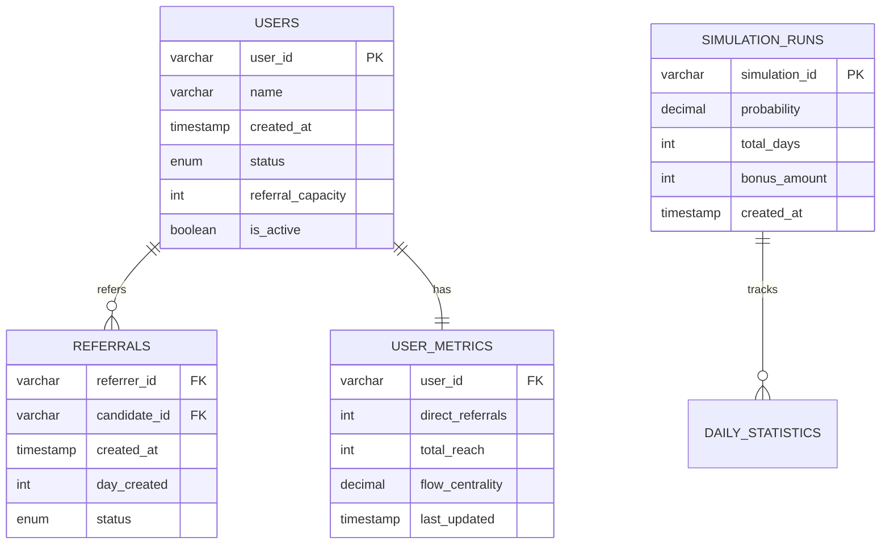

# Referral Network System - Mercor Challenge Solution

## Database Design Overview



## Project Overview

I'm solving the Mercor referral network challenge - 5 interconnected parts that build from basic graph operations to business optimization. Each part taught me something new about algorithms and system design.

---

# Part 1: Basic Referral Graph

## My Approach & Thinking

**The Problem**: Store referral relationships with 3 strict constraints
- No self-referrals (obvious)
- Unique referrer per person (business rule)
- No cycles (maintain hierarchy)

**My Thought Process**:
1. First instinct: adjacency matrix? No - O(V²) space is wasteful for sparse networks
2. Simple adjacency list? Good for space but constraint checking would be expensive
3. **Key insight**: Use dual data structures - one optimized for storage, one for constraints

**Solution Design**:
- Main graph: `adjacency_list[referrer] = {candidates}`
- Constraint helper: `referred_by[candidate] = referrer`
- Validation strategy: fail-fast with increasing cost (O(1) → O(1) → O(V+E))

### Core Implementation
```cpp
class ReferralNetwork {
    std::unordered_map<std::string, std::unordered_set<std::string>> graph;
    std::unordered_map<std::string, std::string> referred_by;  // the key insight
    
    bool addReferral(const std::string& referrer, const std::string& candidate) {
        if (referrer == candidate) return false;              // cheap check first
        if (referred_by.count(candidate)) return false;       // O(1) constraint
        if (wouldCreateCycle(referrer, candidate)) return false; // expensive last
        
        // safe to add
        graph[referrer].insert(candidate);
        referred_by[candidate] = referrer;
        return true;
    }
};
```

**Why this works**: The reverse mapping gives me O(1) unique referrer checking instead of scanning the entire graph.

---

# Part 2: Network Reach Analysis

## My Approach & Learning

**The Challenge**: Calculate total influence (direct + indirect referrals)

**Initial thinking**: Should I use DFS or BFS? The problem mentioned BFS specifically.

**Why BFS made sense to me**:
- Better cache locality for wide graphs
- Natural level-by-level exploration
- Avoids stack overflow on deep networks
- Matches how influence actually spreads in real networks

**Algorithm intuition**: Start from a user, explore all their direct referrals, then explore those people's referrals, etc. Keep track of who I've seen to avoid counting twice.

### Key Implementation
```cpp
std::unordered_set<std::string> getFullReach(const std::string& user) {
    std::unordered_set<std::string> reachable;
    std::queue<std::string> q;
    std::unordered_set<std::string> visited;
    
    q.push(user);
    visited.insert(user);
    
    while (!q.empty()) {
        std::string current = q.front();
        q.pop();
        
        for (const std::string& neighbor : graph[current]) {
            if (!visited.count(neighbor)) {
                visited.insert(neighbor);
                reachable.insert(neighbor);  // this person is reachable
                q.push(neighbor);             // explore their network too
            }
        }
    }
    return reachable;
}
```

**For top-k referrers**: Just calculate everyone's reach and sort. Not the most efficient but straightforward and works fine for reasonable network sizes.

**Choosing k**: Depends on what you're analyzing - small teams (k=3-5), medium orgs (k=10-20), large analysis (k=100+).

---

# Part 3: Finding Real Influencers

## My Approach & Insights

**The realization**: Total reach isn't always what you want. Sometimes you need more sophisticated metrics.

### Metric 1: Unique Reach Expansion

**Business scenario I imagined**: Marketing team has budget for 3 influencers. Want to reach maximum unique people with minimal overlap.

**My approach**: This is basically the "set cover" problem which is NP-hard, so I used a greedy approximation.

**Algorithm intuition**:
1. Pre-compute everyone's total reach
2. Pick the person who covers the most new people
3. Update "already covered" set
4. Repeat until k people selected

```cpp
// Core greedy logic
for (int i = 0; i < k; i++) {
    int max_new = 0;
    std::string best_user;
    
    for (const auto& [user, reach] : all_reaches) {
        if (already_selected(user)) continue;
        
        int new_count = 0;
        for (const std::string& person : reach) {
            if (!already_covered.count(person)) new_count++;
        }
        
        if (new_count > max_new) {
            max_new = new_count;
            best_user = user;
        }
    }
    // select best_user and update covered set
}
```

**Why greedy works**: Gets about 63% of optimal solution, which is good enough for practical use.

### Metric 2: Flow Centrality

**Business scenario**: HR wants to know which employees are "critical bridges" - people whose departure would fragment the network.

**My understanding**: A person is important if they lie on many shortest paths between other people. They're like critical intersections in a road network.

**Algorithm approach**:
1. Compute shortest distances between all pairs (BFS from each node)
2. For each person, count how many shortest paths go through them
3. Higher count = more critical

```cpp
// Key insight: v is on shortest path from s to t if:
// distance(s,v) + distance(v,t) == distance(s,t)
for (const std::string& s : users) {
    for (const std::string& t : users) {
        if (s != t && s != v && t != v) {
            if (dist[s][v] + dist[v][t] == dist[s][t]) {
                score++;  // v is a bridge between s and t
            }
        }
    }
}
```

### When to Use Each Metric

**Total Reach**: Commission structures - sales director gets cut from entire tree

**Unique Reach**: Marketing campaigns - pick influencers to reach max unique people  

**Flow Centrality**: Risk management - identify people whose departure hurts network most

---

# Part 4: Growth Simulation

## My Approach & Challenges

**The new challenge**: Move from static analysis to dynamic modeling. This was the hardest part for me.

**Understanding the model**:
- 100 initial active users
- Each can make max 10 referrals in their lifetime
- Each day: active users have probability p of making a referral
- Track cumulative expected referrals over time

**Key insight**: This is about mathematical expectation, not simulating individual random events.

**My approach**:
1. Track each user's remaining capacity
2. Each day: calculate expected referrals = (active users) × p
3. Update capacities based on expected referrals made
4. Accumulate the daily expectations

### Core Logic
```cpp
for (int day = 0; day < days; day++) {
    // count users who can still refer
    int active_count = 0;
    for (const auto& user : users) {
        if (user.active && user.capacity_left > 0) {
            active_count++;
        }
    }
    
    double expected_today = active_count * p;
    cumulative[day] = (day == 0) ? expected_today : cumulative[day-1] + expected_today;
    
    // update capacities (the tricky part)
    updateCapacities(p);
}
```

**For days_to_target**: Used binary search since more days = more referrals (monotonic relationship).

**Challenges I faced**: How to update capacities properly? Used expected value approach rather than random simulation.

---

# Part 5: Bonus Optimization

## My Approach & Solution

**The business problem**: Find minimum bonus (in $10 increments) to reach hiring target.

**Key insights**:
1. `adoption_prob(bonus)` is monotonically increasing
2. This makes it perfect for binary search
3. Can reuse simulation logic from Part 4

**My algorithm**:
1. Binary search on bonus amount (0 to reasonable upper bound)
2. For each bonus: get probability, run simulation, check if target reached
3. Find minimum bonus that achieves target

### Implementation
```cpp
int min_bonus_for_target(int days, int target, 
                        std::function<double(int)> adoption_prob, double eps) {
    int left = 0, right = 100000;
    int result = -1;
    
    while (left <= right) {
        int mid = (left + right) / 2;
        int bonus = ((mid + 5) / 10) * 10;  // round to nearest $10
        
        double prob = adoption_prob(bonus);
        auto sim_result = simulate(prob, days);
        
        if (sim_result.back() >= target - eps) {
            result = bonus;
            right = mid - 1;  // try smaller bonus
        } else {
            left = mid + 1;   // need bigger bonus
        }
    }
    return result;
}
```

**Time complexity**: O(log(max_bonus) × simulation_time) = O(log(max_bonus) × days)

**Why this works**: Leverages monotonicity + reuses existing simulation infrastructure.

---

# Testing & Results

## Compilation
```bash
make run
# or: g++ -std=c++17 -Wall -Wextra -O2 -o test referral_network.cpp test_referral_network.cpp
```

## Validation Approach
```cpp
// Part 1: Constraint testing
assert(net.addReferral("Alice", "Bob"));
assert(!net.addReferral("Alice", "Alice"));    // no self-referral
assert(!net.addReferral("Charlie", "Bob"));    // unique referrer

// Part 2: Reach calculation  
int reach = net.getTotalReferralCount("Alice");
auto top3 = net.getTopReferrers(3);

// Part 3: Advanced metrics
auto unique = net.getUniqueReachExpansion(2);
auto brokers = net.getFlowCentrality();

// Part 4: Simulation
NetworkSimulation sim;
auto growth = sim.simulate(0.1, 30);
int days_needed = sim.days_to_target(0.1, 500);

// Part 5: Optimization
auto adoption = [](int bonus) { return bonus * 0.001; };
int min_bonus = min_bonus_for_target(30, 200, adoption, 1e-3);
```

---

## Reflections & Learning

**What I learned**:
- Graph algorithms have many real-world applications
- Constraint enforcement needs careful design
- Greedy algorithms can be surprisingly effective
- Mathematical modeling is key for business problems
- Binary search applies to many optimization problems

**What I'd improve**:
- More sophisticated simulation (Monte Carlo methods)
- Better flow centrality algorithms for large graphs
- More error handling and edge cases
- Database integration for production use

**Most challenging part**: Part 4's simulation modeling - bridging from static algorithms to dynamic systems thinking.

**Most satisfying**: Seeing how each part built on previous ones, especially reusing simulation logic in Part 5. 
