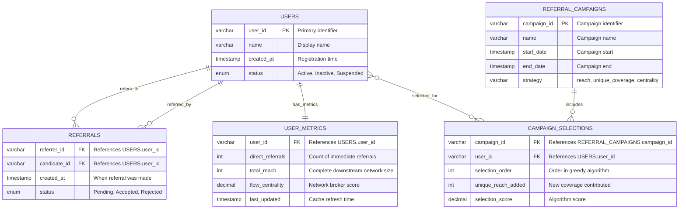

# Referral Network System - Low-Level Design

## Problem Statement

Design a referral network system that:
1. Manages directed referral relationships between users
2. Enforces business constraints (no self-referrals, unique referrer, acyclic graph)
3. Calculates influence metrics for business analytics
4. Scales to handle 10K+ users with efficient operations

## Requirements Analysis

### Functional Requirements
- **FR1**: Add referral relationship between two users
- **FR2**: Query direct referrals for any user
- **FR3**: Calculate total downstream reach (BFS traversal)
- **FR4**: Rank top k referrers by total influence
- **FR5**: Find optimal influencer set with minimal overlap (greedy selection)
- **FR6**: Identify network brokers via flow centrality

### Non-Functional Requirements
- **NFR1**: Sub-second response for single-user queries
- **NFR2**: Handle 10K+ users, 50K+ referral relationships
- **NFR3**: Memory usage O(V + E) where V=users, E=relationships
- **NFR4**: Constraint validation must prevent invalid graph states

### Business Constraints
- **C1**: No self-referrals (user cannot refer themselves)
- **C2**: Unique referrer (each user can be referred by only one other user)
- **C3**: Acyclic graph (prevent circular referral chains)

## Low-Level Design

### Core Classes & Interfaces

```cpp
class ReferralNetwork {
private:
    // Primary data structures
    std::unordered_map<std::string, std::unordered_set<std::string>> adjacency_list;
    std::unordered_map<std::string, std::string> referred_by_map;
    
    // Helper methods
    bool hasCycle(const std::string& from, const std::string& to);
    bool dfsHasCycle(const std::string& current, const std::string& target,
                     std::unordered_set<std::string>& visited,
                     std::unordered_set<std::string>& recursion_stack);
    std::unordered_set<std::string> bfsReachability(const std::string& start);
    std::unordered_map<std::string, int> bfsDistances(const std::string& source);

public:
    // Core operations (FR1, FR2)
    bool addReferral(const std::string& referrer, const std::string& candidate);
    std::unordered_set<std::string> getDirectReferrals(const std::string& user);
    
    // Analytics operations (FR3-FR6)
    int getTotalReferralCount(const std::string& user);
    std::vector<std::pair<std::string, int>> getTopReferrers(int k);
    std::vector<std::pair<std::string, int>> getUniqueReachExpansion(int k);
    std::vector<std::pair<std::string, double>> getFlowCentrality();
    
    // Utility operations
    bool hasUser(const std::string& user);
    int getUserCount();
    void clear();
};
```

### Data Structure Design Decisions

#### Primary Storage: Adjacency List
```cpp
std::unordered_map<std::string, std::unordered_set<std::string>> adjacency_list;
```
**Decision Rationale:**
- **Space Complexity**: O(V + E) vs O(V²) for adjacency matrix
- **Access Pattern**: Sparse graphs (typical referral networks have low connectivity)
- **Operation Efficiency**: O(1) average case for user lookup, O(degree) for neighbor iteration

#### Constraint Enforcement: Reverse Mapping
```cpp
std::unordered_map<std::string, std::string> referred_by_map;
```
**Decision Rationale:**
- **Unique Referrer Constraint**: O(1) validation instead of O(V) graph traversal
- **Memory Trade-off**: Additional O(V) space for O(V) time savings per validation
- **Consistency**: Maintain bidirectional relationship integrity

### Algorithm Design & Analysis

#### 1. Constraint Validation (C1, C2, C3)

```cpp
bool addReferral(const std::string& referrer, const std::string& candidate) {
    // C1: Self-referral check - O(1)
    if (referrer == candidate) return false;
    
    // C2: Unique referrer check - O(1)
    if (referred_by_map.contains(candidate)) return false;
    
    // C3: Cycle detection - O(V + E)
    if (hasCycle(referrer, candidate)) return false;
    
    // Update both data structures
    adjacency_list[referrer].insert(candidate);
    referred_by_map[candidate] = referrer;
    return true;
}
```

**Design Choice**: Fail-fast validation with increasing computational cost
- Layer 1: O(1) input validation
- Layer 2: O(1) business rule validation  
- Layer 3: O(V + E) graph property validation

#### 2. Cycle Detection Algorithm

```cpp
bool hasCycle(const std::string& from, const std::string& to) {
    // Check if adding edge (from -> to) creates cycle
    // Equivalent to: does path exist from 'to' back to 'from'?
    std::unordered_set<std::string> visited, recursion_stack;
    return dfsHasCycle(to, from, visited, recursion_stack);
}
```

**Algorithm Choice: DFS with Recursion Stack**
- **Time**: O(V + E) per edge addition
- **Space**: O(V) for visited sets
- **Alternative Rejected**: Union-Find (doesn't handle deletions efficiently)
- **Alternative Rejected**: Topological sort (requires full reconstruction)

#### 3. Reachability Analysis (FR3)

```cpp
std::unordered_set<std::string> bfsReachability(const std::string& start) {
    std::unordered_set<std::string> reachable;
    std::queue<std::string> queue;
    std::unordered_set<std::string> visited;
    
    queue.push(start);
    visited.insert(start);
    
    while (!queue.empty()) {
        std::string current = queue.front();
        queue.pop();
        
        for (const std::string& neighbor : adjacency_list[current]) {
            if (!visited.contains(neighbor)) {
                visited.insert(neighbor);
                reachable.insert(neighbor);
                queue.push(neighbor);
            }
        }
    }
    return reachable;
}
```

**Algorithm Choice: BFS over DFS**
- **Cache Locality**: Better memory access patterns for large graphs
- **Stack Safety**: Avoids recursion stack overflow on deep networks
- **Level Processing**: Natural breadth-first exploration

#### 4. Unique Coverage Algorithm (FR5)

```cpp
std::vector<std::pair<std::string, int>> getUniqueReachExpansion(int k) {
    // Pre-compute reachability for all users
    std::unordered_map<std::string, std::unordered_set<std::string>> user_reach;
    for (const auto& [user, _] : adjacency_list) {
        user_reach[user] = bfsReachability(user);
    }
    
    // Greedy selection
    std::unordered_set<std::string> global_covered;
    std::vector<std::pair<std::string, int>> result;
    
    for (int i = 0; i < k; i++) {
        std::string best_user;
        int max_new_coverage = 0;
        
        for (const auto& [user, reach] : user_reach) {
            if (isAlreadySelected(user, result)) continue;
            
            int new_coverage = calculateNewCoverage(reach, global_covered);
            if (new_coverage > max_new_coverage) {
                max_new_coverage = new_coverage;
                best_user = user;
            }
        }
        
        if (max_new_coverage > 0) {
            result.push_back({best_user, max_new_coverage});
            updateGlobalCoverage(user_reach[best_user], global_covered);
        }
    }
    return result;
}
```

**Algorithm Choice: Greedy Set Cover Approximation**
- **Problem Type**: NP-hard optimization problem (Maximum Coverage)
- **Approximation Ratio**: (1 - 1/e) ≈ 0.632 of optimal solution
- **Time Complexity**: O(k × V²) with memoization
- **Alternative Rejected**: Exact DP (exponential state space)

#### 5. Flow Centrality Algorithm (FR6)

```cpp
std::vector<std::pair<std::string, double>> getFlowCentrality() {
    std::vector<std::string> all_users = getAllUsers();
    std::unordered_map<std::string, std::unordered_map<std::string, int>> distances;
    
    // Pre-compute all-pairs shortest paths via multiple BFS
    for (const std::string& source : all_users) {
        distances[source] = bfsDistances(source);
    }
    
    // Calculate centrality scores
    std::vector<std::pair<std::string, double>> centrality;
    for (const std::string& node : all_users) {
        double score = 0.0;
        
        for (const std::string& s : all_users) {
            for (const std::string& t : all_users) {
                if (s != t && s != node && t != node) {
                    // Check if node lies on shortest path from s to t
                    if (distances[s][node] + distances[node][t] == distances[s][t]) {
                        score += 1.0;
                    }
                }
            }
        }
        centrality.push_back({node, score});
    }
    
    std::sort(centrality.begin(), centrality.end(),
              [](const auto& a, const auto& b) { return a.second > b.second; });
    return centrality;
}
```

**Algorithm Choice: All-Pairs Shortest Path + Betweenness**
- **Time**: O(V × (V + E)) for unweighted graphs
- **Space**: O(V²) for distance matrix
- **Alternative Rejected**: Floyd-Warshall O(V³) - unnecessarily expensive for sparse graphs
- **Alternative Rejected**: Johnson's algorithm - overkill for unweighted graphs

## Complexity Analysis

| Operation | Time Complexity | Space Complexity | Bottleneck |
|-----------|-----------------|------------------|------------|
| `addReferral` | O(V + E) | O(V) | Cycle detection |
| `getDirectReferrals` | O(1) | O(1) | Hash lookup |
| `getTotalReferralCount` | O(V + E) | O(V) | BFS traversal |
| `getTopReferrers` | O(V × (V + E) + V log V) | O(V) | Computing all reaches |
| `getUniqueReachExpansion` | O(k × V²) | O(V²) | Greedy selection |
| `getFlowCentrality` | O(V² × (V + E)) | O(V²) | All-pairs distances |

## Memory Layout & Performance

### Cache Efficiency
```cpp
// Adjacency list: cache-friendly iteration
for (const std::string& neighbor : adjacency_list[user]) {
    // Sequential access pattern
}

// Hash map optimization: reserve capacity
adjacency_list.reserve(expected_user_count);
```

### Memory Optimization Opportunities
1. **String Interning**: Reduce memory footprint for user IDs
2. **Compact Storage**: Use integer IDs with string mapping
3. **Lazy Computation**: Cache expensive metric calculations

## Database Schema (Production Migration)

### Entity-Relationship Diagram



### Schema Implementation

```sql
-- Core user management
CREATE TABLE users (
    user_id VARCHAR(50) PRIMARY KEY,
    name VARCHAR(100) NOT NULL,
    created_at TIMESTAMP DEFAULT CURRENT_TIMESTAMP,
    status ENUM('Active', 'Inactive', 'Suspended') DEFAULT 'Active',
    INDEX idx_status (status)
);

-- Referral relationships with constraints
CREATE TABLE referrals (
    referrer_id VARCHAR(50) NOT NULL,
    candidate_id VARCHAR(50) NOT NULL,
    created_at TIMESTAMP DEFAULT CURRENT_TIMESTAMP,
    status ENUM('Pending', 'Accepted', 'Rejected') DEFAULT 'Accepted',
    PRIMARY KEY (referrer_id, candidate_id),
    FOREIGN KEY (referrer_id) REFERENCES users(user_id) ON DELETE CASCADE,
    FOREIGN KEY (candidate_id) REFERENCES users(user_id) ON DELETE CASCADE,
    CHECK (referrer_id != candidate_id),  -- C1: No self-referrals
    INDEX idx_referrer (referrer_id),
    INDEX idx_candidate (candidate_id),
    UNIQUE KEY uk_candidate (candidate_id)  -- C2: Unique referrer constraint
);

-- Pre-computed metrics cache (performance optimization)
CREATE TABLE user_metrics (
    user_id VARCHAR(50) PRIMARY KEY,
    direct_referrals INT DEFAULT 0,
    total_reach INT DEFAULT 0,
    flow_centrality DECIMAL(10,6) DEFAULT 0,
    last_updated TIMESTAMP DEFAULT CURRENT_TIMESTAMP,
    FOREIGN KEY (user_id) REFERENCES users(user_id) ON DELETE CASCADE,
    INDEX idx_total_reach (total_reach DESC),
    INDEX idx_flow_centrality (flow_centrality DESC)
);

-- Campaign management for business analytics
CREATE TABLE referral_campaigns (
    campaign_id VARCHAR(50) PRIMARY KEY,
    name VARCHAR(100) NOT NULL,
    start_date TIMESTAMP NOT NULL,
    end_date TIMESTAMP NOT NULL,
    strategy ENUM('reach', 'unique_coverage', 'centrality') NOT NULL,
    created_at TIMESTAMP DEFAULT CURRENT_TIMESTAMP
);

-- Results of greedy selection algorithms
CREATE TABLE campaign_selections (
    campaign_id VARCHAR(50),
    user_id VARCHAR(50),
    selection_order INT NOT NULL,
    unique_reach_added INT DEFAULT 0,
    selection_score DECIMAL(10,6) DEFAULT 0,
    PRIMARY KEY (campaign_id, user_id),
    FOREIGN KEY (campaign_id) REFERENCES referral_campaigns(campaign_id) ON DELETE CASCADE,
    FOREIGN KEY (user_id) REFERENCES users(user_id) ON DELETE CASCADE,
    INDEX idx_campaign_order (campaign_id, selection_order)
);
```

### Database Design Rationale

**Constraint Enforcement at DB Level:**
- `CHECK (referrer_id != candidate_id)` → Prevents self-referrals (C1)
- `UNIQUE KEY uk_candidate (candidate_id)` → Enforces unique referrer (C2)  
- Acyclic constraint (C3) enforced by application logic during insertion

**Performance Optimizations:**
- **Strategic Indexing**: Fast lookups on referrer_id, candidate_id, metrics
- **Metrics Caching**: Pre-computed expensive calculations in `user_metrics`
- **Cascade Deletes**: Automatic cleanup of dependent records

**Scalability Considerations:**
- **Partitioning**: Can partition `referrals` by referrer_id for horizontal scaling
- **Read Replicas**: Separate analytical queries from transactional operations
- **Materialized Views**: Further caching for frequently accessed top-k queries

## Testing Strategy

```cpp
class ReferralNetworkTest {
public:
    void testConstraintEnforcement() {
        ReferralNetwork network;
        
        // Test C1: Self-referral prevention
        assert(!network.addReferral("Alice", "Alice"));
        
        // Test C2: Unique referrer constraint
        assert(network.addReferral("Alice", "Bob"));
        assert(!network.addReferral("Charlie", "Bob"));
        
        // Test C3: Cycle prevention
        network.addReferral("Bob", "Charlie");
        assert(!network.addReferral("Charlie", "Alice"));
    }
    
    void testAlgorithmCorrectness() {
        // Test BFS reachability
        // Test greedy approximation quality
        // Test centrality calculations
    }
    
    void testPerformance() {
        // Benchmark operations on 10K user network
        // Validate O(V+E) complexity bounds
    }
};
```

---

*This LLD demonstrates systematic approach to data structure selection, algorithm design, and performance optimization for a production referral network system.* 
