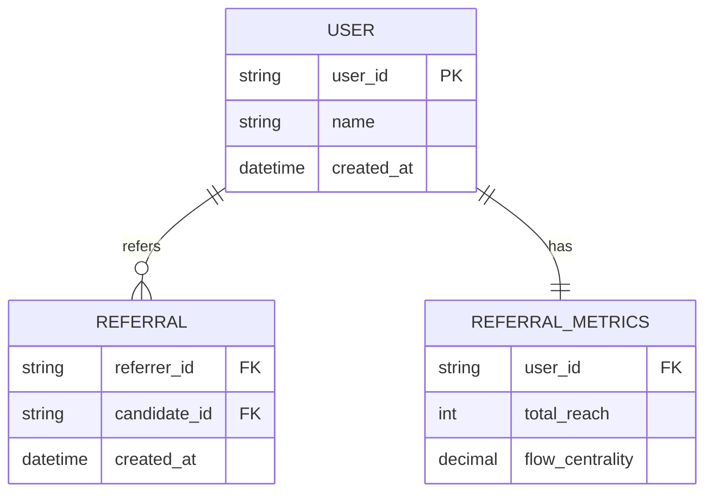

# Referral Network System - Mercor Coding Challenge

A comprehensive C++ implementation of a referral network system that manages user referral relationships with strict constraints and provides advanced analytics for identifying influential users.

## Features

### High-Level Architecture

```
┌─────────────────┐    ┌─────────────────┐    ┌─────────────────┐
│   Client Apps   │    │   Analytics     │    │   Admin Panel   │
│   (Web/Mobile)  │    │   Dashboard     │    │   (Management)  │
└─────────┬───────┘    └─────────┬───────┘    └─────────┬───────┘
          │                      │                      │
          └──────────────────────┼──────────────────────┘
                                 │
                    ┌─────────────┴─────────────┐
                    │    API Gateway Layer      │
                    │  (Load Balancing, Auth)   │
                    └─────────────┬─────────────┘
                                  │
                    ┌─────────────┴─────────────┐
                    │   Referral Service Core   │
                    │    (Business Logic)       │
                    └─────────────┬─────────────┘
                                  │
          ┌───────────────────────┼───────────────────────┐
          │                       │                       │
    ┌─────┴─────┐       ┌─────────┴─────────┐    ┌────────┴────────┐
    │  Primary  │       │   Analytics       │    │     Cache       │
    │ Database  │       │   Data Store      │    │    (Redis)      │
    │ (OLTP)    │       │    (OLAP)         │    │   Hot Metrics   │
    └───────────┘       └───────────────────┘    └─────────────────┘
```

### Part 1: Core Referral Graph
- **User Management**: Add and track users in the referral network
- **Referral Relationships**: Create directed referral links between users
- **Constraint Enforcement**:
  - No self-referrals
  - Unique referrer per candidate
  - Acyclic graph structure

### Part 2: Network Reach Analysis
- **Total Referral Count**: Calculate complete downstream network using BFS
- **Top Referrers Ranking**: Identify users with highest total influence

### Part 3: Advanced Influencer Metrics
- **Unique Reach Expansion**: Greedy algorithm to find optimal influencer combinations
- **Flow Centrality**: Identify critical network brokers and connectors

## Architecture & Design Decisions

### Core Data Structure
```cpp
class ReferralNetwork {
private:
    std::unordered_map<std::string, std::unordered_set<std::string>> graph;  // referrer -> referrals
    std::unordered_map<std::string, std::string> referred_by;               // candidate -> referrer
};
```

**Why This Design:**
- **Adjacency List**: O(V + E) space vs O(V²) for matrix, optimal for sparse graphs
- **Reverse Mapping**: O(1) unique referrer constraint checking
- **Hash Maps**: O(1) average case lookups for user operations

### Algorithm Implementation

#### 1. Cycle Detection - DFS with Recursion Stack
```cpp
bool dfsHasCycle(const std::string& current, const std::string& target,
                 std::unordered_set<std::string>& visited,
                 std::unordered_set<std::string>& rec_stack);
```
- **Time**: O(V + E) per check
- **Why DFS**: Handles dynamic updates better than topological sort

#### 2. Network Reach - BFS Traversal
```cpp
std::unordered_set<std::string> getFullReach(const std::string& user);
```
- **Time**: O(V + E) per user
- **Why BFS**: Better cache locality than DFS, avoids stack overflow

#### 3. Unique Reach Expansion - Greedy Algorithm
```cpp
// Pre-compute reaches, then greedy selection
for (int i = 0; i < k && static_cast<size_t>(i) < graph.size(); i++) {
    // Select user with maximum new coverage
}
```
- **Time**: O(k × V²)
- **Why Greedy**: Practical approximation, exact solution is NP-hard

#### 4. Flow Centrality - Multiple BFS
```cpp
// Check if v lies on shortest path from s to t
if (dist_s_v + dist_v_t == dist_s_t) centrality_score += 1.0;
```
- **Time**: O(V² + VE)
- **Why Multiple BFS**: More efficient than Floyd-Warshall for sparse graphs

## Compilation and Usage

```bash
# Compile and run tests
make run

# Or manually compile
g++ -std=c++17 -Wall -Wextra -O2 -o test_referral_network referral_network.cpp test_referral_network.cpp
```

## Complexity Analysis

| Operation | Time Complexity | Space Complexity | 
|-----------|----------------|------------------|
| **Add Referral** | O(V + E) | O(V) |
| **Get Total Reach** | O(V + E) | O(V) |
| **Top k Referrers** | O(V² + V log V) | O(V) |
| **Unique Reach** | O(k × V²) | O(V²) |
| **Flow Centrality** | O(V² + VE) | O(V²) |

## Business Scenario Analysis

### 1. Total Reach Metric
**Use Case**: Commission structures, performance evaluation  
**Best For**: Hierarchical sales organizations  
**Example**: Sales director gets commission from entire downstream network

### 2. Unique Reach Expansion Metric
**Use Case**: Marketing campaign optimization  
**Best For**: Minimizing audience overlap in targeted campaigns  
**Example**: Select 3 influencers to reach maximum unique customers

### 3. Flow Centrality Metric
**Use Case**: Risk management, retention priorities  
**Best For**: Identifying critical network connectors  
**Example**: Employees whose departure would fragment the network

## Key Engineering Decisions

| **Decision** | **Chosen** | **Alternative** | **Rationale** |
|-------------|------------|-----------------|---------------|
| Graph Representation | Adjacency List | Adjacency Matrix | O(V+E) vs O(V²) space for sparse graphs |
| Cycle Detection | DFS + Recursion Stack | Union-Find | Better for dynamic edge additions |
| Reach Calculation | BFS | DFS | Cache locality, stack safety |
| Unique Coverage | Greedy Algorithm | Exact DP | Polynomial time vs exponential |

## Database Design (Production)



## Testing

The implementation includes comprehensive tests covering:
- Constraint validation (self-referrals, unique referrer, acyclic)
- Network reach calculations with BFS
- Influencer metric algorithms
- Business scenario demonstrations

Run tests: `make run`

---

*Implementation demonstrates advanced graph algorithms, constraint handling, and business-focused analytics for referral network management.* 
