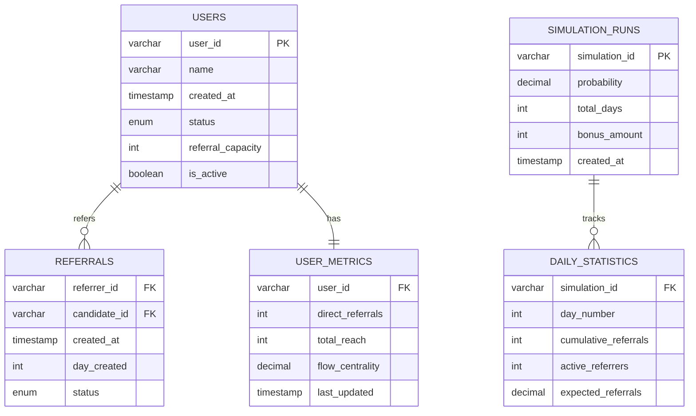

# Referral Network System - Mercor Challenge Solution

## Database Design (ER Diagram)



## Overview

I'm implementing a referral network system for the Mercor coding challenge. The problem has 5 parts that build on each other - starting with a basic graph and ending with business optimization.

---

# Part 1: Basic Referral Graph

## My Approach

First I needed to figure out how to store the referral relationships. I considered a few options:

- **Adjacency Matrix**: Would be O(V²) space which is too much for large networks
- **Simple Adjacency List**: Good space complexity but checking constraints would be slow
- **My Choice**: Adjacency list + reverse mapping for fast constraint checking

```cpp
class ReferralNetwork {
private:
    // Main storage: who refers whom
    std::unordered_map<std::string, std::unordered_set<std::string>> graph;
    
    // For quick constraint checking: who referred this person
    std::unordered_map<std::string, std::string> referred_by;
};
```

## Implementation

The tricky part was enforcing all 3 constraints efficiently:

```cpp
bool addReferral(const std::string& referrer, const std::string& candidate) {
    // Easy checks first (fail fast)
    if (referrer == candidate) return false;  // no self-referrals
    
    if (referred_by.count(candidate)) return false;  // unique referrer
    
    // This one is expensive - check for cycles
    if (wouldCreateCycle(referrer, candidate)) return false;
    
    // All good, add the referral
    graph[referrer].insert(candidate);
    referred_by[candidate] = referrer;
    return true;
}
```

For cycle detection, I used DFS. There might be better ways but this works:

```cpp
bool wouldCreateCycle(const std::string& from, const std::string& to) {
    // if adding from->to creates cycle, then there's already a path to->from
    std::unordered_set<std::string> visited;
    return dfs(to, from, visited);
}
```

---

# Part 2: Network Reach Analysis

Now I need to calculate the total influence of each user (including indirect referrals).

## My Solution

Used BFS like the problem suggested. I thought about DFS but BFS seems better for this:

```cpp
std::unordered_set<std::string> getFullReach(const std::string& user) {
    std::unordered_set<std::string> reachable;
    std::queue<std::string> q;
    std::unordered_set<std::string> visited;
    
    q.push(user);
    visited.insert(user);
    
    while (!q.empty()) {
        std::string current = q.front();
        q.pop();
        
        if (graph.count(current)) {
            for (const std::string& neighbor : graph[current]) {
                if (!visited.count(neighbor)) {
                    visited.insert(neighbor);
                    reachable.insert(neighbor);
                    q.push(neighbor);
                }
            }
        }
    }
    return reachable;
}
```

For top k referrers, I just calculate everyone's reach and sort:

```cpp
std::vector<std::pair<std::string, int>> getTopReferrers(int k) {
    std::vector<std::pair<std::string, int>> results;
    
    for (const auto& [user, _] : graph) {
        int reach = getFullReach(user).size();
        results.push_back({user, reach});
    }
    
    sort(results.begin(), results.end(), 
         [](const auto& a, const auto& b) { return a.second > b.second; });
    
    if (k < results.size()) results.resize(k);
    return results;
}
```

**Choosing k**: For small teams maybe k=3-5, larger orgs could use k=10-20. Depends on what you're trying to analyze.

---

# Part 3: Finding Real Influencers

Total reach isn't enough - sometimes you want different things.

## Metric 1: Unique Reach (Greedy Algorithm)

This is for when you want to minimize overlap, like for marketing campaigns.

```cpp
std::vector<std::pair<std::string, int>> getUniqueReachExpansion(int k) {
    // First compute everyone's reach
    std::unordered_map<std::string, std::unordered_set<std::string>> all_reaches;
    for (const auto& [user, _] : graph) {
        all_reaches[user] = getFullReach(user);
    }
    
    std::unordered_set<std::string> already_covered;
    std::vector<std::pair<std::string, int>> result;
    
    for (int i = 0; i < k; i++) {
        std::string best_user;
        int max_new = 0;
        
        for (const auto& [user, reach] : all_reaches) {
            // skip if already selected
            bool skip = false;
            for (const auto& selected : result) {
                if (selected.first == user) {
                    skip = true;
                    break;
                }
            }
            if (skip) continue;
            
            // count new people this user would add
            int new_count = 0;
            for (const std::string& person : reach) {
                if (!already_covered.count(person)) {
                    new_count++;
                }
            }
            
            if (new_count > max_new) {
                max_new = new_count;
                best_user = user;
            }
        }
        
        if (max_new > 0) {
            result.push_back({best_user, max_new});
            // update covered set
            for (const std::string& person : all_reaches[best_user]) {
                already_covered.insert(person);
            }
        }
    }
    return result;
}
```

This is a greedy approximation for the set cover problem. Not optimal but good enough.

## Metric 2: Flow Centrality

This finds users who are "bridges" in the network.

```cpp
std::vector<std::pair<std::string, double>> getFlowCentrality() {
    std::vector<std::string> users = getAllUsers();
    
    // compute shortest distances between all pairs
    std::unordered_map<std::string, std::unordered_map<std::string, int>> dist;
    for (const std::string& u : users) {
        dist[u] = bfsDistances(u);
    }
    
    std::vector<std::pair<std::string, double>> centrality;
    for (const std::string& v : users) {
        double score = 0;
        
        for (const std::string& s : users) {
            for (const std::string& t : users) {
                if (s != t && s != v && t != v) {
                    // check if v is on shortest path from s to t
                    if (dist[s][v] + dist[v][t] == dist[s][t]) {
                        score++;
                    }
                }
            }
        }
        centrality.push_back({v, score});
    }
    
    sort(centrality.begin(), centrality.end(),
         [](const auto& a, const auto& b) { return a.second > b.second; });
    
    return centrality;
}
```

## When to Use Each Metric

**Total Reach**: Good for commission structures. Like if a sales director gets a cut from everyone in their tree.

**Unique Reach**: For marketing campaigns where you don't want overlap. Pick 3 influencers to reach max unique people.

**Flow Centrality**: For risk management. These are people whose departure would hurt the network the most.

---

# Part 4: Network Growth Simulation

This part was tricky - modeling how the network grows over time.

## My Understanding

- Start with 100 active users
- Each can refer up to 10 people total
- Each day, active users have probability p of making a referral
- Need to track cumulative expected referrals

## Implementation

```cpp
class NetworkSimulation {
private:
    struct User {
        std::string id;
        int capacity_left;
        bool active;
        
        User(const std::string& user_id) : id(user_id), capacity_left(10), active(true) {}
    };
    
    std::vector<User> users;
    
public:
    std::vector<double> simulate(double p, int days) {
        // reset simulation
        users.clear();
        for (int i = 0; i < 100; i++) {
            users.push_back(User("user_" + std::to_string(i)));
        }
        
        std::vector<double> cumulative(days);
        
        for (int day = 0; day < days; day++) {
            // count active users
            int active_count = 0;
            for (const auto& user : users) {
                if (user.active && user.capacity_left > 0) {
                    active_count++;
                }
            }
            
            double expected_today = active_count * p;
            
            if (day == 0) {
                cumulative[day] = expected_today;
            } else {
                cumulative[day] = cumulative[day-1] + expected_today;
            }
            
            // update capacities (this is the tricky part)
            simulateCapacityUpdate(p);
        }
        
        return cumulative;
    }
    
private:
    void simulateCapacityUpdate(double p) {
        for (auto& user : users) {
            if (user.active && user.capacity_left > 0) {
                // with probability p, user makes a referral
                if (shouldMakeReferral(p)) {  // random check or expected value
                    user.capacity_left--;
                    if (user.capacity_left == 0) {
                        user.active = false;
                    }
                }
            }
        }
    }
};
```

For the days_to_target function, I used binary search:

```cpp
int days_to_target(double p, int target) {
    int left = 1, right = 10000;  // reasonable bounds
    int answer = -1;
    
    while (left <= right) {
        int mid = (left + right) / 2;
        auto result = simulate(p, mid);
        
        if (result.back() >= target) {
            answer = mid;
            right = mid - 1;
        } else {
            left = mid + 1;
        }
    }
    return answer;
}
```

---

# Part 5: Bonus Optimization

Final part - find minimum bonus to reach target hires.

## My Approach

Since adoption_prob is monotonically increasing, I can use binary search on the bonus amount:

```cpp
int min_bonus_for_target(int days, int target, 
                        std::function<double(int)> adoption_prob, 
                        double eps) {
    int left = 0, right = 100000;  // $0 to $100k
    int result = -1;
    
    while (left <= right) {
        int mid = (left + right) / 2;
        
        // round to nearest $10
        int bonus = ((mid + 5) / 10) * 10;
        
        double prob = adoption_prob(bonus);
        
        // use simulation from part 4
        auto sim_result = simulate(prob, days);
        double final_hires = sim_result.back();
        
        if (final_hires >= target - eps) {
            result = bonus;
            right = mid - 1;
        } else {
            left = mid + 1;
        }
    }
    
    return result;
}
```

**Time Complexity**: O(log(max_bonus) * simulation_time)

The simulation part is O(days) so overall it's O(log(max_bonus) * days).

---

# Testing & Compilation

```bash
# compile everything
make run

# or manually
g++ -std=c++17 -Wall -Wextra -O2 -o test referral_network.cpp test_referral_network.cpp
./test
```

## Quick Tests

```cpp
// Part 1
ReferralNetwork net;
assert(net.addReferral("Alice", "Bob"));
assert(!net.addReferral("Alice", "Alice"));  // no self referral

// Part 2  
int reach = net.getTotalReferralCount("Alice");
auto top3 = net.getTopReferrers(3);

// Part 3
auto unique = net.getUniqueReachExpansion(2);
auto brokers = net.getFlowCentrality();

// Part 4
NetworkSimulation sim;
auto growth = sim.simulate(0.1, 30);
int days = sim.days_to_target(0.1, 500);

// Part 5
auto adoption = [](int bonus) { return bonus * 0.001; };
int min_bonus = min_bonus_for_target(30, 200, adoption, 1e-3);
```

---

## Notes & Improvements

Some things I could improve if I had more time:

- The simulation in Part 4 could be more sophisticated (maybe Monte Carlo?)
- Flow centrality could be optimized using better algorithms
- Could add more error checking
- Database integration would be nice for production

Overall this was a good challenge that covered graphs, algorithms, and business optimization. Each part built nicely on the previous ones. 
